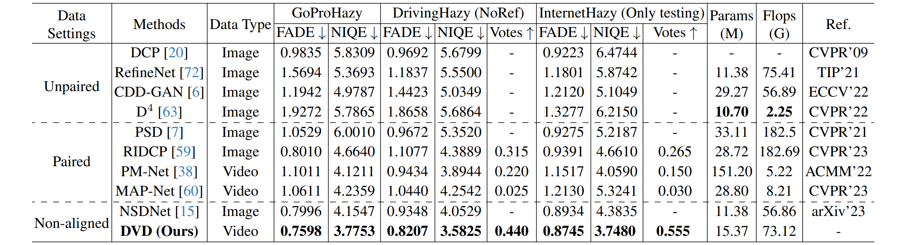

# DVD: Driving-Video Dehazing with Non-Aligned Regularization for Safety Assistance (CVPR 2024)

[Junkai Fan](https://fanjunkai1.github.io/),
[Jiangwei Weng](https://wengjiangwei.github.io/),
[Kun Wang](https://github.com/w2kun/),
[Yijun Yang](https://yijun-yang.github.io/),
[Jianjun Qian](http://www.patternrecognition.asia/qian/),
[Jun Li<sup>*</sup>](https://sites.google.com/view/junlineu/),
[Jian Yang<sup>*</sup>](https://scholar.google.com/citations?user=6CIDtZQAAAAJ&hl=zh-CN)   
(* indicates corresponding author)

PCA Lab, Nanjing University of Science and Technology; HKUST(GZ)


[](https://arxiv.org/pdf/2405.09996)
[](https://fanjunkai1.github.io/projectpage/DVD/index.html)
[](https://www.youtube.com/watch?v=BHFVx8yv4SY)

[[Poster](figs/DVD_poster.pdf)]

This repository represents the official implementation of the paper titled "Driving-Video Dehazing with Non-Aligned Regularization for Safety Assistance".

## :fire: Updates
- [16-06-2024] Added train and inference code (this repository).
- [15-06-2024] We created the [project homepage](https://fanjunkai1.github.io/projectpage/DVD/index.html) and the GitHub README.

## :mega: Pipeline
Our method effectively trains the video dehazing network using real-world hazy and clear videos without requiring strict alignment, resulting in high-quality results.


The overall framework of our driving-video dehazing (DVD) comprising two crucial components: frame matching and video
dehazing. This involves applying frame dehazing to proactively eliminate haze from individual frames. One significant benefit is the
effectiveness and efficiency of our method in training the video dehazing network using authentic driving data without requiring strict
alignment, ultimately producing high-quality results. (b) The illustration depicts the matching process of non-aligned, clear reference
frames through the utilization of an adaptive sliding window using the feature cosine similarity. **Our input consists of two frames**.


## 💡 GoProHazy, DrivingHazy (real-world hazy video datasets)


To collect pairs of hazy/clear video pairs, follow these steps: 
1). As illustrated in Collection Method (a), we capture hazy videos in various scenes under hazy weather conditions. 
2). In Collection Method (b), to maintain consistent scene brightness, we choose overcast days with good visibility for capturing clear video pairs. 
    Additionally, to ensure the reference clear video matches the hazy scene, we align clear video capture with the starting point of the hazy videos. 
3). Video cropping is employed to ensure that the starting and ending points of the collected hazy/clear video pairs are consistent.

**Our real-world hazy video dataset can be downloaded here:**
[GoProHazy](),
[DrivingHazy](),
[InternetHazy]()


## :hammer: Installation
- Ubuntu 18.04
- Python == 3.9
- PyTorch == 1.11 with CUDA 11.3
- torchvision ==0.12.0
- conda 4.12

```
# git clone this repository
git clone https://github.com/fanjunkai1/DVD.git
cd DVD

# create new anaconda env
conda create -n DVD python=3.9
conda activate DVD

# install python dependencies
pip install -r requirements.txt

# install DCN V2
cd ops/DCNv2
python setup.py build develop # build
python test.py # run examples and check

```


**Note** 

## :rocket: Get Started

1. Downloading pre-trained checkpoints

| Model              | Description                                                                                                                                 | :link: Download Links    |
|  :-----:           |  :---------------------------------------------------------------------------------:                                                        | :----------------------: |
|   Optical Flow     |   By utilizing pre-trained optical flow to guide initial position sampling, enhance the receptive field of cosine similarity calculation.   | <a href="">Baidu Disk</a>|
|   Frame Dehazing   |   Frame dehazing module was pre-trained on misaligned hazy/clear image paired data.                                                         | <a href="">Baidu Disk</a>|
|   Video Dehazing   |   Video dehazing module trained on video frame sequence data.                                                                               | <a href="">Baidu Disk</a>|


2. Organize data for training, using GoProHazy as an example, as follow:

~~~
{DVD ROOT}
|-- pre_dehazing
|   |-- models
|   |   |-- remove_hazy_model_256x256.pth
|-- pretrained
|   |-- spynet_sintel_final-3d2a1287.pth
|-- datasets
|   |-- foggy_video
|   |   |-- train_video
|   |   |   |-- TrainClipsFrames
|   |   |   |   |-- hazyframe_seq
|   |   |   |   |   |-- 00001_hazyframe_seq
|   |   |   |   |   |   |-- 00001
|   |   |   |   |   |   |   |-- frame_0_hazy.jpg
|   |   |   |   |   |   |   |-- frame_1_hazy.jpg
|   |   |   |   |   |   |-- ...
|   |   |   |   |-- clearframe
|   |   |   |   |   |-- 00001_clearframe
|   |   |   |   |   |   |-- 00001
|   |   |   |   |   |   |   |-- frame_0_clear.jpg
|   |   |   |   |   |   |   |-- frame_1_clear.jpg
|   |   |   |   |   |   |-- ...
|   |   |   |-- TrainMatchFrames   
|   |   |   |   |-- 1_hazy&clear_frames.txt
|   |   |   |   |-- ...
|   |   |-- test_video
|   |   |-- val_video

|-- data
|   |--meta_info
|   |  |-- meta_info_GoPro_train_frames_seq.txt
|   |  |-- meta_info_GoPro_test_frames_seq.txt
|   |  |-- meta_info_GoPro_val_frames_seq.txt
~~~

**Note**: For organizing the data structure above, you can use the script we provide with the following commands:
```
python reorganize_data.py --input_frames_num 2  
--index_txt_path ./datasets/foggy_video/train_video/TrainMatchFrames
--save_hazyframe_seq_path ./datasets/foggy_video/train_video/TrainClipsFrames/hazyframe_seq  
--save_clearframe_path ./datasets/foggy_video/train_video/TrainClipsFrames/clearframe
```
```
python generate_meta_info.py --hazyframe_path ./datasets/foggy_video/train_video/TrainClipsFrames/hazyframe_seq
--clearframe_path ./datasets/foggy_video/train_video/TrainClipsFrames/clearframe
--save_meta_info_path ./data/meta_info/meta_info_GoPro_train_frames_seq.txt
```
## 🏋️ Training and Testing

Train our DVD by
```
CUDA_VISIBLE_DEVICES=0,1 python3.9 -m torch.distributed.launch --nproc_per_node=2 --master_port=4321 train.py -opt options/train/train_DVD.yml --launcher pytorch
```
Test our DVD by
```
CUDA_VISIBLE_DEVICES=0,1 python3.9 -m torch.distributed.launch --nproc_per_node=2 --master_port=4321 test.py -opt options/test/test_DVD.yml --launcher pytorch
```


## ⚡ Inference DVD

Firstly, place the trained model in the `checkpoint/DVD` folder, then place the video frames to be tested in the `input_video_frame` folder, and check the inference results in the `out_video_frame` folder.
```
python inference_single_video.py --visual_enhance_model_path checkpoint/DVD/net_g_latest.pth
--input_path input_video_frame
--dehazing_model_path pre_dehazing/models/remove_hazy_model_256x256.pth
--save_path output_video_frame
```

## 📊 Results

Quantitative results on three real-world hazy video datasets. ↓ denotes the lower the better. ↑ denotes the higher the better. Due
to PM-Net and MAP-Net rely on GT for training, we use Lcx to train them on GoProHazy dataset. Note that we only selected the latest
dehazing methods (i.e., RIDCP, PM-Net and MAP-Net) and our DVD for the user study. Moreover, DrivingHazy and InternetHazy were
tested on dehazing models trained using GoProHazy and pre-trained dehazing models provided by the authors, respectively.

## 🎬 Video demo
To validate the stability of our video dehazing results, we present a video result captured in a real driving
environment and compare it with the latest video dehazing state-of-the-art method, MAP-Net.

https://github.com/fanjunkai1/DVD/assets/138647972/05eda045-7122-412b-87c0-8ba6a49fadc1.mp4


## 🎓 Citation
If you are interested in this work, please consider citing:

```bibtex
@inproceedings{fan2024driving,
  title={Driving-Video Dehazing with Non-Aligned Regularization for Safety Assistance},
  author={Fan, Junkai and Weng, Jiangwei and Wang, Kun and Yang, Yijun and Qian, Jianjun and Li, Jun and Yang, Jian},
  booktitle={Proceedings of the IEEE/CVF Conference on Computer Vision and Pattern Recognition},
  pages={26109--26119},
  year={2024}
}

@article{fan2023non,
  title={Non-aligned supervision for Real Image Dehazing},
  author={Fan, Junkai and Guo, Fei and Qian, Jianjun and Li, Xiang and Li, Jun and Yang, Jian},
  journal={arXiv preprint arXiv:2303.04940},
  year={2023}
}
```

## 🤗 Acknowledgment
This code is based on the [BasicSR](https://github.com/XPixelGroup/BasicSR). Thank them for their outstanding work.

## 📧 Contact
Should you have any question or suggestion, please contact junkai.fan@njust.edu.cn.
